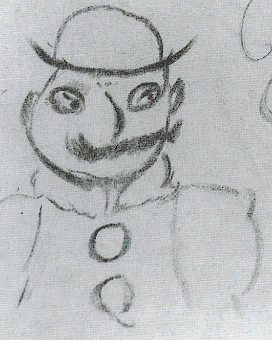
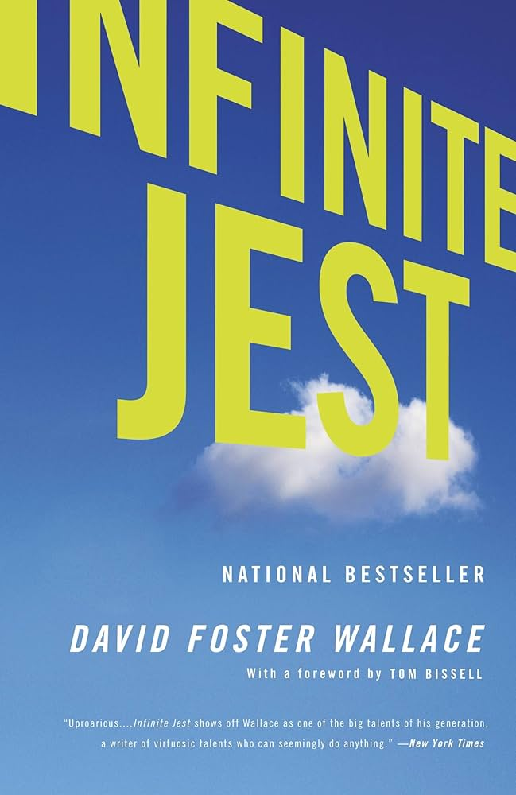
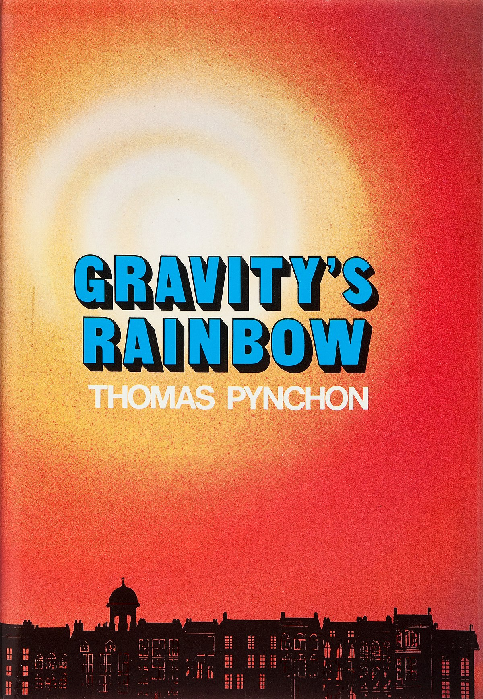

## B: Philosophy, Psychology, Religion
- Durant, Will -- *The Story of Philosophy: The Lives and Opinions of the Greatest Philosophers* <!--B72.D8 1933-->
- Aristotle -- *Nicomachean Ethics* <!--B430.A5 C5-350-->
- Aristotle -- *Metaphysics* <!--B434.A5 M5-350-->
- Aurelius, Marcus -- *Meditations* <!--B580-->
- Seneca -- *On the Shortness of Life* <!--B616.D532 E5 0-->
- Sartre, Jean-Paul -- *Being and Nothingness* <!--B819 .S272 1943-->
- Źiźek, Slavoj -- *The Sublime Object of Ideology* <!--B823.3 .Z59 1989-->
- Kant, Immanuel -- *Critique of Pure Reason* <!--B2778.E5 1781-->
- Nietzsche, Friedrich -- *Thus Spoke Zarathustra* <!--B3313.A45 E5-->
- Nietzsche, Friedrich -- *Beyond Good and Evil* <!--B3313.J43 E5-->
- Nietzsche, Friedrich -- *The Gay Science* <!--B3313.F72 E5-->
- Nietzsche, Friedrich -- *The Will to Power* <!--B3313.W53 E5-->
- Nietzsche, Friedrich -- *On the Genealogy of Morals* <!--B3313.Z73 E5-->
- Nietzsche, Friedrich -- *The Portable Nietzsche* <!--B3312.E52 K3-->
- Tanner, Michael -- *Nietzsche: A Very Short Introduction* <!--B3317.T36-->
- Kaufmann, Walter A. -- *Nietzsche: Philosopher, Psychologist, Antichrist* <!--B3317.K29-->
- Mumford, Stephen -- *Metaphysics: A Very Short Introduction* <!--BD131.M86-->
- Audi, Robert -- *Epistemology: A Contemporary Introduction to the Theory of Knowledge, 3rd Edition* <!--BD1-->
- Berger, Peter. L -- *The Social Construction of Reality: A Treatise in the Sociology of Knowledge* <!--BD175.B4-->
- Greene, Robert -- *The 48 Laws of Power* <!--BD438.G74-->
- Chase, Stuart -- *The Tyranny of Words* <!--BF455.C45-->
- Hall, Manly P. -- *The Secret Teachings of all Ages: An Encyclopedic Outline of Masonic, Hermetic, Qabbalistic and Rosicrucian Symbolical Philosophy* <!--BF1411.H3 2010-->
- Hanegraaff, Wouter J. -- *Esotericism and the Academy: Rejected Knowledge in Western Culture* <!--BF1411.H363-->
-  -- *Lemegeton: The Complete Books I-V: Ars Geotia, Ars Theurgia Goetia, Ars Paulina, Ars Almadel, Ars Notoria* <!--BF1611.C5413-->
- Driver, Julia -- *Ethics: The Fundamentals* <!--BJ71.D75-->
- Veyne, Paul -- *Did the Greeks Believe in Their Myths?: An Essay on the Constitutive Imagination* <!--BL782.V4713-->
- Gray, John -- *Seven Types of Atheism* <!--BL2747.G68-->
- Saint Augustine -- *The Confessions of St. Augustine of Hippo* <!--BR65.A6-->
- Kierkegaard, Søren -- *Fear and Trembling and The Sickness Unto Death* <!--BR100.K52-->
- Coogan, Michael D. -- *The New Oxford Annotated Bible: New Revised Standard Version* <!--BS191.A1 .N48-->

## C: Auxiliary Sciences of History
- Graeber, D. & Wengrow, D -- *The Dawn of Everything: A New History of Humanity* <!--CB19.G73 2023-->
- Harari, Yuval -- *Sapiens: A Brief History of Humankind* <!--CB113.H4 H3713-->
- Morris, Ian -- *Why the West Rules---For Now: The Patterns of History and What They Reveal About the Future* <!--CB251.M68-->
- Kaczynski, Theodore John -- *Industrial Society and Its Future: Unabomber Manifesto* <!--CB478-->
- Morris, Ian -- *War! What Is It Good For? Conflict and the Progress of Civilization from Primates to Robots* <!--CB481.M67-->
- Acosta, Oscar Zeta -- *The Autobiography of a Brown Buffalo* <!--CT275.A186 A3-->
- Acosta, Oscar Zeta -- *The Revolt of the Cockroach People* <!--CT275.A186 A3-->

## D: World History
- Evola, Ilulius -- *Revolt Against the Modern World* <!--D16.E8513-->
- White, Matthew -- *The Great Big Book of Horrible Things: The Definitive Chronicle of History’s 100 Worst Atrocities* <!--D24.W45-->
- Herodotus -- *The Histories* <!--D58.H4713-->
- Tyerman, Christopher -- *God's War: A New History of the Crusades* <!--D157.T89 2006-->
- Hobhouse, Henry -- *Forces of Change: An Unorthodox View of History* <!--D210.H66-->
- Wedgwood, C. V. -- *The Thirty Years War* <!-- D258.W4 2005 -->
- Jünger, Ernst -- *Storm of Steel* <!--D640.J69313-->
- Bauman, Zygmunt - *Modernity and the Holocaust* <!--D804.3-->
- Frank, Anne -- *The Diary of a Young Girl* <!--D810.J4 F717-->
- Frankl, Viktor E. -- *Man’s Search for Meaning* <!--D810.J4 F72713-->
- Malaparte, Curzio -- *Kaputt* <!--D811.M28413 2005-->
- White, T. H. -- *The Age of Scandal* <!--DA485.W48-->
- Roberts, Andrew -- *Churchill: Walking with Destiny* <!--DA566.C5 R576-->
- Carlyle, Thomas -- *The French Revolution* <!--DC161.C3-->
- Roberts, Andrew -- *Napoleon: A Life* <!--DC203.R678-->
- Orwell, George -- *Down and Out in Paris and London* <!--DC715.O7-->
- Eyck, Erich -- *Bismarck and the German Empire* <!--DD218-->
- Shirer, William L. -- *The Rise and Fall of the Third Reich: A History of Nazi Germany* <!--DD256.S48-->
- Beard, Mary -- *SPQR: A History of Ancient Rome* <!--DG231.B43-->
- Caesar, Julius -- *The Civil War* <!--DG266.C42-->
- Gibbon, Edward -- *The Decline and Fall of the Roman Empire: Volume 1* <!--DG311.G5-->
- Gibbon, Edward -- *The Decline and Fall of the Roman Empire: Volume 2* <!--DG311.G5-->
- Gibbon, Edward -- *The Decline and Fall of the Roman Empire: Volume 3* <!--DG311.G5-->
- Sartre, Jean-Paul -- *Anti-Semite and Jew: An Exploration of The Etiology of Hate* <!--DS145.S272-->
- Chang, Iris -- *The Rape of Nanking: The Forgotten Holocaust of World War II* <!--DS796.N2-->
- Mao, Tse-Tung -- *Quotations from Chairman Mao Tse-Tung: The Little Red Book* <!--DS778.M3 A5155-->

## E: History of the United States of America
- Thompson, Hunter S. -- *Fear and Loathing on the Campaign Trail ‘72* <!--E859.T52-->
- Thompson, Hunter S. -- *The Great Shark Hunt: Strange Tales from a Strange Time (Gonzo Papers, Volume 1)* <!--E855.T49-->
- Thompson, Hunter S. -- *Generation of Swine: Tales of Shame and Degradation in the ’80s (Gonzo Papers, Volume 2)* <!--E876.T48-->
- Thompson, Hunter S. -- *Songs of the Doomed: More Notes on the Death of the American Dream (Gonzo Papers, Volume 3)* <!--E839.T47-->
- Thompson, Hunter S. -- *Better Than Sex: Confessions of a Political Junkie (Gonzo Papers, Volume 4)* <!--E884.T46-->

## F: History of Canada
- Grant, George -- *Lament for a Nation: The Defeat of Canadian Nationalism* <!--F1034.G742-->
- Black, Conrad -- *Rise to Greatness, Volume 1: Colony (1000-1867): The History of Canada From the Vikings to the Present* <!--FC165.B53-->

## H: Social Sciences
- Fisher, Mark -- *Capitalist Realism: Is There No Alternative?* <!--HB501-->
- Tuckfield, Bradford -- *Dive into Data Science: Use Python to Tackle Your Toughest Business Challenges* <!--HF5548.5.P98 T83 2023-->
- Stirner, Max -- *The Ego and Its Own* <!--HM136.S7413-->
- Camus, Albert -- *The Rebel: An Essay on Man in Revolt* <!--HM281.C3513-->
- McGowan, David -- *Programmed to Kill: The Politics of Serial Murder* <!--HM647.M34-->
- Engels, Friedrich -- *The Origin of the Family, Private Property and the State* <!--HQ504.E6 2010-->
- Haidt, Jonathan -- *The Anxious Generation: How the Great Rewiring of Childhood Is Causing an Epidemic of Mental Illness* <!--HQ792.U5 H23-->
- Brooks, David -- *The Social Animal: Hidden Sources of Love, Character and Achievement* <!--HQ801.B76-->
- Bly, Robert -- *Iron John: A Book About Men* <!--HQ1090.B59-->
- Sutherland, Gillian -- *In Search of the New Woman: Middle-Class Women and Work in Britain 1870-1914* <!--HQ1593-->
- de Beauvoir, Simone -- *The Second Sex* <!--HQ1208.B352-->
- Ohler, Norman -- *Blitzed: Drugs in Nazi Germany* <!--HV5840.G3 03513-->
- Carrol, Rory -- *Killing Thatcher: The IRA, the Manhunt and the Long War on the Crown* <!--HV6433.G713 C377-->
- Thompson, Hunter S. -- *Hell’s Angels: The Strange and Terrible Saga of the Outlaw Motorcycle Gangs* <!--HV.6489.C2 T48-->
- Vronsky, Peter -- *Sons of Cain: A History of Serial Killers from the Stone Age to the Present* <!--HV6505 .V76-->
- Vronsky, Peter -- *Serial Killers: The Method and Madness of Monsters* <!--HV6515.V76-->
- Marx, Karl & Engles, Friedrich -- *The Communist Manifesto* <!--HX39.A523-->
- Lenin, Vladimir Ilich -- *State and Revolution* <!--HX314-->
- Kropotkin, Peter -- *The Conquest of Bread* <!--HX632.K7613-->

## J: Political Science
- Plato -- *Republic* <!--JC71-->
- Machiavelli, Niccoló -- *The Prince* <!--JC143.M38-->
- Hobbes, Thomas -- *Leviathan* <!--JC153.H65-->
- Trotsky, Leon -- *Fascism: What Is It and How to Fight It* <!--JC481.T715-->
- Mill, John Stuart -- *On Liberty, Utilitarianism and Other Essays* <!--JC585.M62-->
- Talbot, David -- *The Devil's Chessboard: Allen Dulles, the CIA, and the Rise of America's Secret Government* <!--JK468.I6 T35 2015-->

## M: Music
- Morrissey -- *Autobiography* <!--ML420.M635 A4-->

## N: Fine Arts
- van Gogh, Vincent -- *Dear Theo: The Autobiography of Vincent van Gogh* <!--ND653.G7 A3-->

## P: Philology and Linguistics
- Pinker, Steven -- *The Language Instinct: How the Mind Creates Language* <!--P106.P476-->

## PA: Greek and Latin Literature
- Aeschylus -- *Prometheus Bound* <!--PA3827.P8A352015-->
- Homer -- *Iliad* <!--PA4025.A2 F33-->
- Homer -- *Odyssey* <!--PA4025.A5 F5-->
- Ovid -- *Metamorphoses* <!--PA6522.M2M45-->

## PE: English Language
- William, Jr. Strunk -- *The Elements of Style* <!--PE1408.S772-->
- Zinsser, William -- *On Writing Well: The Classic Guide to Writing Nonfiction* <!--PE1429.Z5-->

## PG: Slavic Literature
- Dostoevsky, Fyodor -- *Notes from Underground* <!--PG3326.Z4-->
- Dostoevsky, Fyodor -- *Crime and Punishment* <!--PG3326.P7-->
- Dostoevsky, Fyodor -- *The Idiot* <!--PG3326.I3-->
- Dostoevsky, Fyodor -- *The Brothers Karamazov* <!--PG3326.B7-->
- Gogol, Nikolai -- *Dead Souls* <!--PG3333.M4 2011-->
- Tolstoy, Leo -- *War and Peace* <!--PG3366-->
- Tolstoy, Leo -- *Anna Karenina* <!--PG3366.A6-->
- Bulgakov, Mikhail -- *The Master and Margarita* <!--PG3476.B78 M313-->

## PL: East Asian Literature
- Sōseki, Natsume -- *The Gate* <!--PL812.A8M613 2012-->
- Sōseki, Natsume -- *Kokoro* <!--PL812.A8 K613-->
- Dazai, Osamu -- *The Setting Sun* <!--PL825.A8 S42-->
- Dazai, Osamu -- *No Longer Human*<!--PL825.A8 N53-->
- Dazai, Osamu -- *A Shameful Life: (Ningen Shikkaku)* <!--PL825.A8 N53-->
- Mishima, Yukio -- *Confessions of a Mask* <!--PL833.I7 C65-->
- Mishima, Yukio -- *The Sound of Waves* <!--PL833.I7 S413-->
- Mishima, Yukio -- *The Temple of the Golden Pavillion* <!--PL818.I7 K13 1994-->
- Mishima, Yukio -- *The Frolic of the Beasts* <!--PL833.I7 K413-->
- Mishima, Yukio -- *The Sailor Who Fell from Grace with the Sea* <!--PL833.I7 G613-->
- Mishima, Yukio -- *Life for Sale* <!--PL833.I7.513 2020-->
- Mishima, Yukio -- *Spring Snow* <!--PL833.I7 H3613-->
- Mishima, Yukio -- *Runaway Horses* <!--PL833.I7 H6613-->
- Mishima, Yukio -- *The Temple of Dawn* <!--PL833.I7 A727-->
- Mishima, Yukio -- *The Decay of the Angel* <!--PL833.I7 T4613-->
- Murakami, Haruki -- *Norwegian Wood* <!--PL856.U673 N6713-->
- Murakami, Ryū -- *In the Miso Soup* <!--PL856.U696 L513-->

## PN: General Literature
- Ligotti, Thomas -- *The Conspiracy Against the Human Race: A Contrivance of Horror* <!--PN56.H6 L54-->
- Davies, Owen -- *Grimoires: A History of Magic Books* <!--PN56.M23 O93-->
- Tyson, Lois -- *Critical Theory Today: A User-Friendly Guide* <!--PN81.T97-->
- Jameson, Fredric -- *Postmodernism or, The Cultural Logic of Late Capitalism (Post-Contemporary Interventions)* <!--PN98.P67 J3-->
- Stein, Sol -- *Stein on Writing* <!--PN151.S84-->
- Thompson, Hunter S. -- *Fear and Loathing in Las Vegas: A Savage Journey to the Heart of the American Dream* <!--PN4874.T444 A3-->

## PQ: Romance Literature
- Hugo, Victor -- *Les Misérables* <!--PQ2286.A1 1862B-->
- Verne, Jules -- *Journey to the Centre of the Earth* <!--PQ2469.V75 E5-->
- Bataille, Georges -- *Story of the Eye* <!--PQ2603.A695 H4813-->
- Beckett, Samuel -- *Waiting For Godot: A Tragicomedy in Two Acts* <!--PQ2603.E378 E52-->
- Camus, Albert -- *The Stranger* <!--PQ2605.A3734-->
- Camus, Albert -- *The Myth of Sisyphus and Other Essays* <!--PQ2605.A3734 M9-->
- Camus, Albert -- *Resistance, Rebellion, and Death* <!--PQ2605.A3734 A25-->
- de Sade, Marquis -- *The 120 Days of Sodom; or, the School of Libertinage* <!--PQ2637.A82 Z46313-->
- Sartre, Jean-Paul -- *War Diaries Notebooks from a Phoney War, 1939-1940* <!--PQ2637.A82 Z46313-->
- Sartre, Jean-Paul -- *Nausea* <!--PQ2637.A82 N313-->
- Sartre, Jean-Paul -- *The Wall: (Intimacy) and Other Stories* <!--PQ2637.A82 N313-->
- Houellebecq, Michel -- Whatever <!--PQ2688.O77 E87-->
- Houellebecq, Michel -- *The Elementary Particles* <!--PQ2668.O77 P3713-->
- Houellebecq, Michel -- *Platform* <!--PQ2668.O77 P5313-->
- Houellebecq, Michel -- *The Map and the Territory* <!--PQ-2668.O77 C37 2011-->
- Houellebecq, Michel -- *Submission* <!--PQ2668.O77-->
- Houellebecq, Michel -- *Annihilation: A Novel* <!--PQ2668.O77 A8313 2024-->
- Leys, Simon -- *The Death of Napoleon* <!-- PQ2672.E99M6713 2015-->
- Alighieri, Dante -- *The Divine Comedy: Volume I: Inferno* <!--PQ4315.E76-->
- Alighieri, Dante -- *The Divine Comedy: Volume II: Purgatorio* <!--PQ4315.H65-->
- Alighieri, Dante -- *The Divine Comedy: Volume III: Paradiso* <!--PQ4315.S32-->
- de Cervantes, Miguel -- *Don Quixote* <!--PQ6329.A2-->
- Bolaño, Roberto -- *2666* <!--PQ8098.O38 A12213-->
- García Márquez, Gabriel -- *One Hundred Years of Solitude* <!--PQ8180.A73-->

## PR: British and Irish Literature

{class="float-right" width="200px"}

- Shakespeare, William -- *Hamlet* <!--PR2812.A2-->
- Shakespeare, William -- *The Complete Works of William Shakespeare*
- Defoe, Daniel -- *A Journal of the Plague Year* <!--PR3404.J6-->
- Milton, John -- *Paradise Lost* <!--PR3560-->
- Austen, Jane -- *Pride and Prejudice* <!--PR4034-->
- Brontë, Charlotte -- *Jane Eyre* <!--PR4167.B766-->
- Butler, Samuel -- *The Way of All Flesh* <!--PR4339.B7 W3-->
- Carroll, Lewis -- *Alice’s Adventures in Wonderland and Through the Looking-Glass* <!--PZ7.D684 A-->
- de Quincey, Thomas -- *Confessions of an English Opium-Eater* <!--PR4534.C6-->
- Eliot, George -- *Middlemarch* <!--PR4662.A2 A83-->
- Gissing, George -- *The Nether World* <!--PR4716.N42-->
- Hogg, James -- *The Private Memoirs of a Justified Sinner* <!--PR4791.P7 2002b-->
- Moore, George -- *Confessions of a Young Man* <!--PR5042.C6-->
- Shelley, Mary -- *Frankenstein* <!--PR5397.F7-->
- Wilde, Oscar -- *The Picture of Dorian Gray* <!--PR5819.A2-->
- Conrad, Joseph -- *The Nigger of the "Narcissus": A Tale of Forecastle* <!--PR6005.O4 H4-->
- Conrad, Joseph -- *Heart of Darkness* <!--PR6005.O4 H4-->
- Conrad, Joseph -- *Nostromo* <!--PR6005.O4 N578-->
- du Maurier, Daphne -- *Don't Look Now: Stories* <!--PR6007.U47D66 2007-->
- Huxley, Aldous -- *Brave New World* <!--PR6015.U9-->
- Joyce, James -- *Dubliners* <!--PR6019.O9 D8-->
- Joyce, James -- *Ulysses* <!--PR6019.O9-->
- Joyce, James -- *Finnegans Wake* <!--PR6019.O9 F5-->
- Orwell, George -- *Animal Farm* <!--PR6029.R8-->
- Orwell, George -- *1984* <!--PR6029.R8-->
- Stoker, Bram -- *Dracula* <!--PR6037.T617-->
- Tolkien, J. R. R. -- *The Hobbit* <!--PZ7.T5744 H-->
- Tolkien, J. R. R. -- *The Lord of The Rings: Volume 1: The Fellowship of the Ring* <!--PR6039.O32-->
- Tolkien, J. R. R. -- *The Lord of The Rings: Volume 2: The Two Towers* <!--PR6039.O32-->
- Tolkien, J. R. R. -- *The Lord of The Rings: Volume 3: The Return of the King* <!--PR6039.O32-->
- Tolkein, J. R .R -- *The Simarillion* <!--PR6039.O32 S-->
- Wyndham, John -- *The Midwich Cuckoos* <!--PR6045.Y64 M53-->
- Ballard, J.G. -- *The Atrocity Exhibition* <!-- PR6052.A46 A93-->
- Burgess, Anthony -- *A Clockwork Orange* <!--PR6052.U638-->
- Welsh, Irvine -- *Trainspotting* <!--PR6073.E47 T73-->
- Williamson, Henry -- *Tarka the Otter* <!--PZ10.3.W678 Ta 2020-->
- Iggulden, Conn -- *Wolf of the Plains* <!--PR6109.G47 G46-->
- Iggulden, Conn -- *Lords of the Bow* <!--PR6109.G47 G464-->
- Iggulden, Conn -- *Bones of the Hills* <!--PR6109.G47 G463-->

## PS: American Literature



{width="200px"}

{width="200px"}
{{
}}

- Melville, Herman -- *Moby-Dick; or, The Whale* <!--PS2384.M6-->
- Poe, Edgar Allen -- *The Complete Poetry of Edgar Allan Poe* <!--PS2605.A1-->
- Stowe, Harriet Beecher -- *Uncle Tom’s Cabin; or, Life Among the Lowly* <!--PS2954.U5-->
- Bradbury, Ray -- *Fahrenheit 451* <!--PS3503.R167-->
- Faulkner, William -- *The Sound and the Fury: The Corrected Text* <!--PS3511.A86-->
- Faulkner, William -- *As I Lay Dying: The Corrected Text* <!--PS3511.A86 A85-->
- Fitzgerald, F. Scott -- *The Great Gatsby* <!--PS3511.I9-->
- Lovecraft, H. P. -- *The Call of Cthulhu* <!--PS3523.L684-->
- Lovecraft, H. P. -- *The Shadow Over Innsmouth* <!--PS3521.O833-->
- Lovecraft, H. P. -- *The H. P. Lovecraft Collection: Classic Tales of Cosmic Horror* <!--PS3523.O92 A6-->
- Miller, Arthur -- *The Crucible: A Play in Four Acts* <!--PS3525.I5156 C7-->
- Miller, Henry -- *Tropic of Cancer* <!--PS3525.I5454-->
- Nabokov, Vladimir -- *Lolita* <!--PS3527.A15-->
- Nabokov, Vladimir -- *Pale Fire* <!--PS3527.A15 P3-->
- Salinger, J.D. -- *The Catcher and the Rye* <!--PS3537.A426-->
- Steinbeck, John -- *Of Mice and Men* <!--PS3537.T3234-->
- Steinbeck, John -- *The Grapes of Wrath* <!--PS3537.T3234 G8-->
- Steinbeck, John -- *East of Eden* <!--PS3537.T3234-->
- Williams, John -- *Butcher’s Crossing* <!--PS3545.I5286 B8-->
- Williams, John -- *Stoner* <!--PS3545.I5286 S7-->
- Williams, John -- *Augustus* <!--PS3545.I5286 A94-->
- Burroughs, William S. -- *Naked Lunch: The Restored Text* <!--PS3552.N2-->
- Bukowski, Charles -- *Notes of a Dirty Old Man* <!--PS3552.U4-->
- Bukowski, Charles -- *Post Office* <!--PS3552.U4-->
- Bukowski, Charles -- *Factotum* <!--PS3552.U4-->
- Bukowski, Charles -- *Women* <!--PS3552.U4 W6-->
- Bukowski, Charles -- *Ham on Rye* <!--PS3552.U4 H3-->
- Connell, Evan S. -- *The Diary of a Rapist* <!--PS3553.O5 D54-->
- Dick, Philip K. -- *Do Androids Dream of Electric Sheep?* <!--PS3554.I3-->
- Dick, Philip K. -- *Ubik* <!--PS3554.I3 U24-->
- Ellis, Bret Easton -- *American Psycho* <!--PS3555.L5937-->
- Heller, Joseph -- *Catch-22* <!--PS3558.E476-->
- Herbert, Frank -- *Dune* <!--PS3558.E63-->
- King, Stephen -- *The Dead Zone* <!--PS3561.I483 D43-->
- King, Stephen -- *On Writing: A Memoir of the Craft* <!--PS3561.I483-->
- Korine, Harmony -- *A Crack-up at the Race Riots* <!--PS3561.O658 C7-->
- McCarthy, Cormac -- *Suttree* <!--PS3563.C337 S9-->
- McCarthy, Cormac -- *Blood Meridian; or, The Evening Redness in the West* <!--PS3563.C337 B4-->
- McCarthy, Cormac -- *The Road* <!--PS3563.C337 R63-->
- McElroy, Joseph -- *Women and Men* <!--PS3563.A293 W6-->
- Plath, Sylvia -- *The Bell Jar* <!--PS3566.L27 B44-->
- Pynchon, Thomas -- *V.* <!--PS3566.Y55 V2-->
- Pynchon, Thomas -- *The Crying of Lot 49* <!--PS3566.Y55 C79-->
- Pynchon, Thomas -- *Gravity’s Rainbow* <!--PS3566.Y55 G7-->
- Pynchon, Thomas -- *Slow Learner* <!--PS3566.Y55 S5 1984-->
- Selby, JR Hubert -- *Requiem for a Dream* <!-- PS3569.A547 R4-->
- Silverberg, Robert -- *Dying Inside* <!--PS3569.I472 -->
- Spinrad, Norman -- *The Iron Dream* <!--PS3569.P55-->
- Vonnegut, Kurt -- *Slaughterhouse-Five* <!--PS3572.O5-->
- Wallace, David Foster -- *Infinite Jest* <!--PS3573.A425635 I54-->
- Aciman, André -- *Call Me by Your Name* <!--PS3601.C525 C35-->
- Auerbach, Dathan -- *Penpal* <!--PS3601.U347P46 2012-->
- M.N. M-D. R. -- *Behead All Satans* <!--I bought a shitty print from an Indian company; despite the shitty print the typography isn't half bad!-->
- Moshfegh, Ottessa -- *My Year of Rest and Relaxation* <!--PS3613.O77936 M9-->
- Yanagihara, Hanya -- *A Little Life* <!--PS3625.A674-->

## PT: German Literature
- von Goethe, Johann Wolfgang -- *Faust, Part One* <!--PT2026.F2-->
- von Goethe, Johann Wolfgang -- *Faust, Part Two* <!--PT2026.F2-->
- Jünger, Ernst -- *On the Marble Cliffs* <!--PT2616.U43 A913 2022-->
- Kafka, Franz -- *The Metamorphosis* <!--PT2621.A26-->
- Kafka, Franz -- *The Trial* <!--PT2621.A26 PZ13-->
- Kafka, Franz -- *The Complete Stories* <!--PT2621.A26 A2-->
- Bernhard, Thomas -- *Correction* <!--PT2662.E7 K613-->

## Q: Science
- Wilson, E. Bright -- *An Introduction to Scientific Research* <!--Q180.A1 W57 1966-->
- Lang, Serge -- *Basic Mathematics* <!--QA39.2-->
- Kells, Lyman M. -- *Elementary Differential Equations* <!--QA47.K4-->
- Beyer, William H. -- *CRC Standard Mathematical Tables* <!--QA47.M315-->
- Isaacson, Walter -- *The Innovators: How a Group of Hackers, Geniuses and Geeks Created the Digital Revolution* <!--QA76.2.A2 I87 2014-->
- Minnick, Chris -- *Coding All-in-One For Dummies* <!--QA76.6-->
- Abelson, Harold & Sussman, Gerald Jay & Sussman, Julie -- *Structure and Interpretation of Computer Programs, Second Edition* <!--QA76.6.A255 1996-->
- Warren, Henry S. -- *Hacker's Delight* <!--QA76.6 .W375 2013-->
- Raymond, Eric S. -- *The Cathedral and the Bazaar: Musings on Linux and Open Source by an Accidental Revolutionary* <!--QA76.76.O63 R397 2001-->
- Greenfield, Joseph D. & Wray, William C. -- *Using Microprocessors and Microcomputers: The 6800 Family* <!--QA76.M67 G75-->
- Hogan, Thom -- *Osborne CP/M user guide* <!--QA76.O73 H64-->
- Flanagan, David -- *Java in a Nutshell: A Desktop Quick Reference* <!--QA76.73.J38 1997-->
- Collens, P. A. & Collens, R. J. & Scuse D. H. & Stanton, R. G. -- *Structured Fortran With WATFIV-S and WATFOR-11S*
- Duckett, Jon -- *PHP & MySQL: Server-side Web Development* <!--QA76.P224 D83-->
- Kiddle, Oliver -- *From Bash to Z Shell: Conquering the Command Line* <!--QA76.76 O63 K53-->
- Matthes, Eric -- *Python Crash Course: A Hands-On, Project-Based Introduction to Programming* <!--QA76.P98 M38-->
- Gjengset, Jon -- *Rust for Rustaceans: Idomatic Programming for Experienced Developers* <!--QA76.73.R87 G54 2022-->
- Klabnik, S & Nichols, C. -- *The Rust Programming Language, 2nd Edition* <!--QA76.73.R87 K53 2017-->
- Gelfand, Israel M. -- *Algebra* <!--QA152.G45-->
- Kohavi, Zvi -- *Switching and Finite Automata Theory* <!--QA267.5.SAK64 1978-->
- Urdan, Timothy C. -- *Statistics in Plain English, 5th Edition* <!--QA276.12-->
- Apostol, Tom M. -- *Calculus, Vol. 1: One-Variable Calculus, with an Introduction to Linear Algebra* <!--QA300.A572-->
- Apostol, Tom M. -- *Calculus, Vol. 2: Multi-Variable Calculus and Linear Algebra with Applications* <!--QA300.A572-->
- Sparks, John C. -- *Calculus Without Limits---Almost* <!--QA302.S68-->
- Bird, Kai & Sherwin, Martin J. -- *American Prometheus: The Triumph and Tragedy of J. Robert Oppenheimer* <!--QC16.O62 B57-->
- Hayt, William Hart -- *Engineering Electromagnetics* <!--QC670.H39 1974-->
- Brown, Theodore L. -- *Chemistry: The Central Science* <!--QD31.3-->
- Naish, Darren -- *Ancient Sea Reptiles: Plesiosaurs, Ichthyosaurs, Mosasaurs, and More* <!--QE861.N35 2022-->
- Brusatte, Stephen L. -- *The Rise and Fall of the Dinosaurs: A New History of a Lost World* <!--QE861.4.B79 2018-->
- Brusatte, Stephen L. -- *The Rise and Reign of the Mammals: A New History from the Shadow of the Dinosaurs to Us* <!--QE881.B86 2022-->
- Richard Dawkins -- *River Out of Eden: A Darwinian View of Life* <!--QH430.D39-->
- Sapolsky, Robert M. -- *Behave: The Biology of Humans at Our Best and Worst* <!--QP351.S27-->
- Squire, Larry R. -- *Fundamental Neuroscience* <!--QP355.2.F862-->
- Kandel, Eric -- *Principles of Neural Science, Sixth Edition* <!--QP355.P76-->
- Pinker, Stephen -- *How the Mind Works* <!--QP360.P56-->
- Hawkins, Jeff -- *On Intelligence: How a New Understanding of the Brain Will Lead to the Creation of Truly Intelligent Machines* <!--QP376.H294-->
- Carew, Thomas J. -- *Behavioral Neurobiology: The Cellular Organization of Natural Behaviour* <!--QP360.C347-->
- Doidge, Norman -- *The Brain That Changes Itself: Stories of Personal Triumph from the Frontiers of Brain Science* <!--QP363.D65-->

## R: Medicine
- Webster, John G. -- *Medical Instrumentation: Application and Design* <!--R856-->
- Maté, Gabor -- *The Myth of Normal: Trauma, Illness & Healing in a Toxic Culture* <!--RA418.M3272-->
- Deleuze, Gilles -- *Anti-Oedipus: Capitalism and Schizophrenia* <!--RC455.D42213-->
- Phares, E. Jerry -- *Clinical Psychology: Concepts, Methods, and Profession* <!--RC467.P48 1979-->
- Frankl, Viktor E. -- *The Will to Meaning: Foundations and Applications of Logotherapy* <!--RC480.5-->
- Eisler, Robert -- *Man Into Wolf: An Anthropological Interpretation of Sadism, Masochism, and Lycanthropy* <!--RC569.V55 E37-->
- Huxley, Aldous -- *The Doors of Perception and Heaven and Hell* <!--RM666.P48 H9-->

## T: Technology
- Kaczynski, Theodore John -- *Technological Slavery* <!--T14.5-->
- Dorf, Richard C. -- *Modern Control Systems* <!--TJ216.D67 1980-->
- Sonntag, Richard E. & Van Wylen, Gordon J. -- *Fundamentals of Thermodynamics* <!--TJ265.S66-->
- B. P. Lathi -- *Communication Systems* <!--TK5101.L3818 1968-->
- Chen, C. T. -- *One-dimensional Digital Signal Processing (Electrical and Computer Engineering)* <!--TK5102.5.C475-->
- McNamara, John E. -- *Technical Aspects of Data Communication* <!--TK5105.M4 1982-->
- Texas Instruments -- *The TTL Data Book for Design Engineers* <!--TK7671.S35 T84-->
- Yunik, Maurice -- *Design of Modern Transistor Circuits* <!--TK7871.9Y85-->
- Coughlin, Robert F. & Driscoll, Frederick F. -- *Operational Amplifiers and Linear Integrated Circuits* <!--TK7871.58.06OC68-->
- Johnson, David E. -- *Introduction to Filter Theory* <!--TK7872.F5J63-->
- Hamilton, Douglas J. & Howard, William G. -- *Basic Integrated Circuit Engineering* <!--TK7874.H345-->
- Millman, Jacob -- *Microelectronics: Digital and Analog Circuits and Systems* <!--TK7874.M527-->
- Kraft, George D. & Toy, Wing N. -- *Mini/Microcomputer Hardware Design* <!--TK7888.3.K7-->
- White, Donnamaie E. -- *Bit-Slice Design: Controllers and ALUs* <!--TK7895.M5W49-->
- Grant, Eugene L. & Leavenworth, Richard S. -- *Statistical Quality Control* <!--TS156.G7 1980-->

## ?: Unsorted
- Blain, Linda -- *Enduring the Empire*
- Dovey, Simon -- *Eye of the Chickenhawk*
- Muhammad, Elijah -- *Yakun (Jacob): Father of Mankind*
- Schertel, Ernst -- *Magic: History / Theory / Practice*
